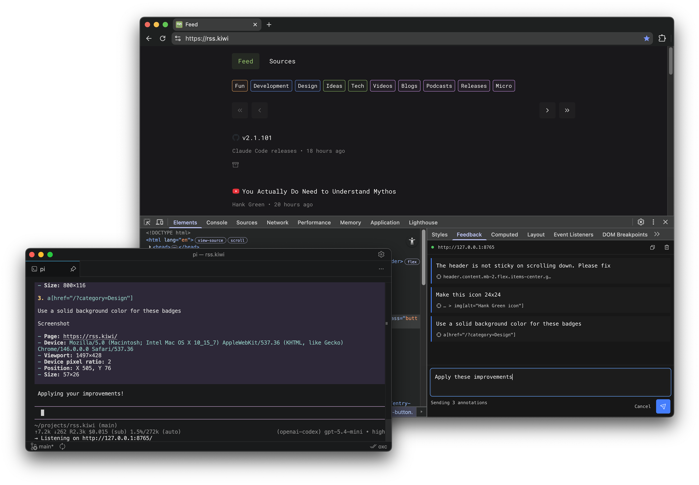
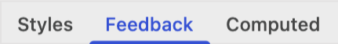

# Browser Annotations

Select elements in the Chrome DevTools, write feedback, and send it to your coding agent.

Install the [Chrome extension](#chrome-extension) and use it with [pi](#pi) or [Claude Code](#claude-code).



## Features

- **Annotate elements** – Select any element and write your feedback
- **Live agent collaboration** – Send feedback directly to your [pi](#pi) or [Claude Code](#claude-code) session
- **Complete context** – Includes an element's selector, position, size, viewport, device info, and a screenshot
- **Source mapping** – Links elements to React and Svelte source code during development
- **Batch annotations** – Combine feedback across multiple elements and pages
- **Works everywhere** – Lives in your DevTools, works on any website
- **Clipboard mode** – Copy feedback as markdown for any workflow

## Installation

### Chrome extension

```bash
pnpm install -g @browser-annotations/chrome-extension
```

Then load the extension in Chrome:

1. Open `chrome://extensions` and enable **Developer mode**
2. Click **Load unpacked** and select `~/browser-annotations/chrome-extension`

### pi

```bash
# 1. Install the extension
pi install git:github.com/wiebekaai/browser-annotations

# 2. Start pi
pi

# 3. Start the browser-annotations server
/browser-annotations
```

### Claude Code

Claude Code is a mess, but man do I love Opus, so here's how to use it:

```bash
# 1. Start Claude Code
claude

# 2. Add marketplace and install extension
/plugin marketplace add wiebekaai/browser-annotations
/plugin install browser-annotations@browser-annotations

# 3. Restart Claude Code with the plugin (here's why it's dangerous: https://code.claude.com/docs/en/channels#research-preview)
claude --dangerously-load-development-channels plugin:browser-annotations@browser-annotations

# ?. If the server keeps running after closing Claude Code, run this. I'll try to find a better solution.
bunx kill-port 8765
```

## Usage

1. Choose your mode
   - **Webhook on** — Send feedback directly to your agent (see [pi](#pi) or [Claude Code](#claude-code) setup)
   - **Webhook off** — Copy feedback as markdown to your clipboard
2. Select an element in the Chrome DevTools
3. Write your feedback in the  tab (drag this tab to the left so it's easily accessible)
4. Use  to batch annotations. Annotations persist per website, so your feedback can span multiple pages
5. Hit  to send to your agent, or  to copy as markdown

> You can always copy to clipboard with keyboard shortcuts, even with webhook enabled.

### Keyboard shortcuts

| Action          | Shortcut                                              |
| --------------- | ----------------------------------------------------- |
| Inspect element | <kbd><kbd>⌘</kbd> <kbd>⌥</kbd> <kbd>C</kbd></kbd>     |
| Add             | <kbd><kbd>⌘</kbd> <kbd>Enter</kbd></kbd>              |
| Submit          | <kbd><kbd>⌘</kbd> <kbd>⇧</kbd> <kbd>Enter</kbd></kbd> |
| Copy current    | <kbd><kbd>⌘</kbd> <kbd>X</kbd></kbd>                  |
| Copy all        | <kbd><kbd>⌘</kbd> <kbd>⇧</kbd> <kbd>X</kbd></kbd>     |
| Clear current   | <kbd><kbd>⌘</kbd> <kbd>K</kbd></kbd>                  |
| Clear all       | <kbd><kbd>⌘</kbd> <kbd>⇧</kbd> <kbd>K</kbd></kbd>     |
| Cancel / Reset  | <kbd>Esc</kbd>                                        |

### Example output

```md
# Feedback

Please refine the homepage

## 1. `div:nth-of-type(4) > h2.section-title`

Title should be 24px


- **Page:** [http://localhost:5173/](http://localhost:5173/)
- **Device:** `Mozilla/5.0 (Macintosh; Intel Mac OS X 10_15_7) AppleWebKit/537.36 (KHTML, like Gecko) Chrome/146.0.0.0 Safari/537.36`
- **Viewport:** 1497×879
- **Device pixel ratio:** 2
- **Position:** X 407, Y 206
- **Size:** 684×36
- **Source:** [`pages/index.tsx:42`](pages/index.tsx)

## 2. `p.docs-button > a[href="/packages"]`

This should open the sidepanel with packages


- **Page:** [http://localhost:5173/](http://localhost:5173/)
- **Device:** `Mozilla/5.0 (Macintosh; Intel Mac OS X 10_15_7) AppleWebKit/537.36 (KHTML, like Gecko) Chrome/146.0.0.0 Safari/537.36`
- **Viewport:** 1497×879
- **Device pixel ratio:** 2
- **Position:** X 407, Y 616
- **Size:** 159×48
- **Source:** [`components/DocsButton.tsx:8`](components/DocsButton.tsx)
```
